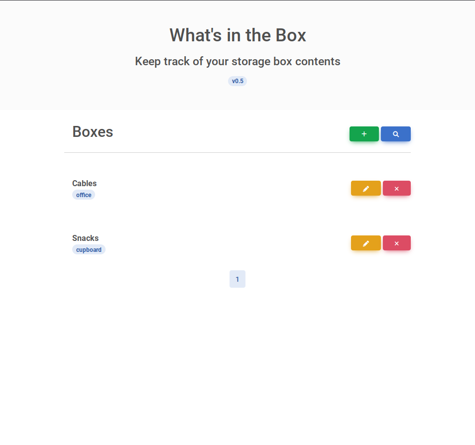

# What's in the Box (WITB)

__What's in the Box__ is a simple storage organization solution aimed to help you identify stuff that you've stored in physical locations such as boxes or containers. 

It was made because I have not found any such solution myself to keep track of what items are stored where.

## How does it work

__What's in the Box__ is a web app written in Golang which communicates with a SQLite database to store boxes and the boxes' contents. You add boxes and contents to your liking. Each box also shows you a QR-Code which you can print out and attach to your boxes. Upon scanning the code, it will open the box in the browser and show you the contents.

### What can it do

Currently __What's in the Box__ supports the following operations:

- Create a box with a name and a label
- Show you a QR-Code that when scanned opens the related box in the web app.
- Edit names and labels of boxes
- Delete boxes and all items associated to the box
- Search for boxes by name or label
- Add items to boxes (with quanitites)
- Edit items in boxes (Change name and quantities)
- Move items to another box
- Delete items from boxes

### What it can't do (yet)

As of yet, it does not have a fully fleshed-out REST API to support scipted/automated operations, although this is planned for future releases. Most of the tasks still need to be executed in the web interface.

### Out-of-scope 

- There are no plans to add authentication to the app since it is designed to be run at home in your own network. If you want to expose it to the internet, make sure to add at least a authentication proxy in front of it or access it via a VPN.
- There is no plans for this app to handle TLS on its own. If you wanna secure the connection you must run this behind a reverse proxy where TLS will be terminated.

### Planned

- Full REST API to support all operations available in the web interface
- Add more attributes to items such as expiration dates for foods.
- Prometheus Metrics (Track Total Items, Total Boxes, other potential metrics)

## Setup

The app is designed to run inside a container although building and running it on your own is also possible.

### Environment variables

| Variable 	| Description                                                   	| Default       	|
|----------	|---------------------------------------------------------------	|---------------	|
| PORT     	| Port for the web interface                                    	| 8088          	| 
| DB       	| Path to the database (will be generated if it does not exist) 	| /tmp/boxes.db 	|
| HTTP_SECURE_SCHEMA       	| Used to correctly set http schema [http / https] for the QR code generation  	| 0 	|

## Screenshots

Home screen

Edit a box

Add content to a box

Search for boxes by name or label

Show qr code for box
